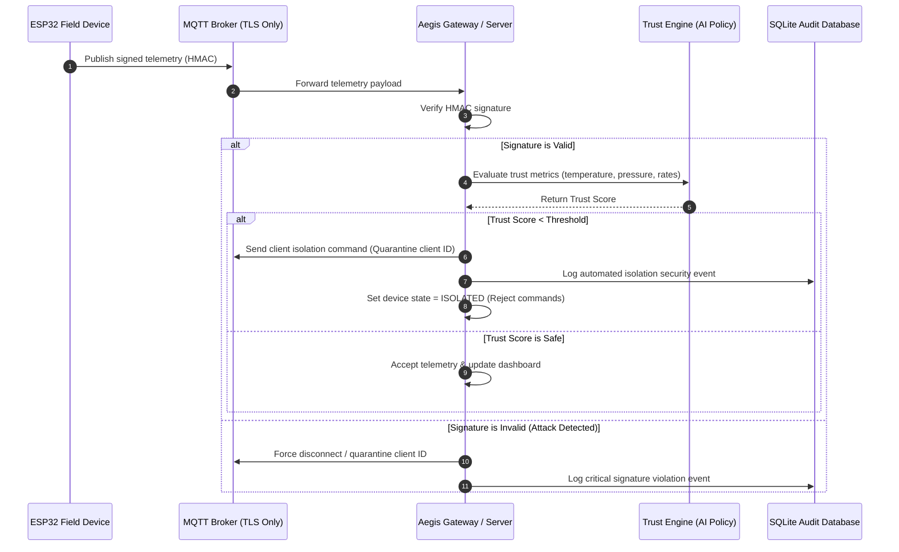

# Aegis ICS


This repository contains two distinct builds implementing zero-trust security for Industrial Control Systems (ICS) and Operational Technology (OT) environments:

### Repository Structure
- **Root (Version 1.0.0)**: Core zero-trust telemetry ingestion, HMAC signature validation, ML trust engine, and automated micro-segmentation isolation at the broker layer.
- **[`version-two/`](file:///C:/Users/admin/.gemini/aegis/scratch/aegis-ics/version-two)**: A separate, hardened build featuring a Stuxnet-proof AI proxy command enforcer, SQLite-backed location coordinate auditing, and mathematical statistical analytics dashboard.

Zero-trust micro-segmentation and device-side policy enforcement for industrial telemetry.


## Novel Contributions
1. Micro-segmentation engine
- Automatically isolates suspicious devices based on live trust scoring.
- Keeps the device running while cutting off unsafe network access.

2. Device-side policy engine
- Rejects unsafe server commands on the device before execution.
- Prevents server compromise from turning into field-device compromise.

## Why This Matters
Most ICS demos stop at anomaly detection. Aegis ICS goes one step further: it enforces policy at the broker, the server, and the device itself, so the system can contain bad behavior instead of only observing it.

## Results In v1
- TLS-only MQTT broker configuration.
- No anonymous broker access.
- Sensitive API routes can require an admin token.
- Telemetry ingest validates payload shape before processing.
- Device isolation is persisted and test-covered.
- Security-critical unit tests pass.

## What Problem It Solves
- Stops malformed or malicious telemetry from crashing the API.
- Blocks invalid control commands at the device boundary.
- Reduces blast radius when a device or server is compromised.
- Prevents unnecessary exposure of secrets, keys, and logs in the repo.

## System Overview
- `esp32_sim/` simulates devices and their local policy checks.
- `server/api/` receives telemetry, scores trust, and serves the dashboard.
- `server/ai_engine/` computes trust and isolates risky devices.
- `server/mqtt_broker/` defines broker TLS and ACL rules.
- `policies/` defines server and device command limits.
- `certs/` generates local TLS certificates.
- `docs/` explains architecture, threats, and evaluation.
- `tests/` verifies the security-critical behavior.

### Zero-Trust Telemetry & Enforcer Flow



## Live Enforcer in Action (Version 2)

Below is an execution trace showing the Stuxnet-proof enforcer blocking a coordinated physical stress attack:

### 1. SCADA Control Server Logs (`app.py`)
```text
 * Running on http://127.0.0.1:5000 (Press CTRL+C to quit)
[Server] Operator 'admin' logged in from Coordinates: X=12.4, Y=-48.1, Z=3.5.
[Server] Operator issued setpoint command: set_pressure = 7.0 bar
[Server] Dispatched control command: set_pressure=7.0
[Server] Telemetry received: Temp=32.40C, Pressure=7.05 bar (Signature: VALID)

[Server] Operator issued setpoint command: set_temp = 55.0C
[Server] AI SECURITY EXPOSURE BLOCK (Stuxnet Prevention): Blocked raising Temperature to 55.0C because live Pressure is 7.05 bar. Coordinated high-temperature/high-pressure damage profile detected.
[Server] Security violation audited to DB for operator 'admin' at Coordinate: X=12.4, Y=-48.1, Z=3.5
```

### 2. Simulated Hardware Device Logs (`simulator.py`)
```text
[ESP32_001] Connected to MQTT Broker - Subscribed to ics/control/ESP32_001
[ESP32_001] Telemetry published: Temp=25.32C, Pres=4.02 bar
[ESP32_001] Applied Pressure setpoint: 7.0 bar
[ESP32_001] Telemetry published: Temp=26.45C, Pres=7.05 bar

# If a compromised operator attempts to override safety limits directly at the hardware:
[ESP32_001] Received direct command: set_temp = 70.0C
[ESP32_001] SECURITY REJECTION: Temp setpoint 70.0C exceeds hard hardware limit (65.0C)!
```

## Quickstart

You can use the new automated PowerShell launcher script to boot up the entire stack with a single click:

```powershell
./start.ps1
```

This menu-driven script automatically takes care of environment configurations, generating TLS certificates, launching the broker services, starting the servers and simulators in separate visual terminal windows, and loading the web dashboard.

Alternatively, to start services manually, read `QUICKSTART.md` for step-by-step instructions.

## Validation
- Run: `python -m unittest discover -s tests`
- CI: GitHub Actions runs the test suite on push and pull request.

## Important Env Vars
- `MQTT_HOST`, `MQTT_PORT`, `MQTT_USE_TLS`, `MQTT_CA_CERT`
- `MQTT_USERNAME`, `MQTT_PASSWORD`
- `FLASK_SECRET_KEY`
- `API_ADMIN_TOKEN`
- `DEVICE_KEY_ESP32_001`, `DEVICE_KEY_ESP32_002`

## Safety Defaults
- TLS is on by default.
- Plain MQTT is not the default.
- Sensitive API routes can require `API_ADMIN_TOKEN`.
- Secrets and generated data are ignored by git.

## Repo Map
- `.env.example` - template for local environment values.
- `.gitignore` - keeps secrets, certs, virtualenvs, and generated data out of git.
- `QUICKSTART.md` - exact commands to run the demo.
- `README.md` - this overview.
- `docs/trust_scoring.md` - mathematical formulas and weighting of the live trust scoring engine.
- `version-two/` - Version 2.0.0 build code.

## Contact & Authors
- **Anshul R**: [LinkedIn](https://www.linkedin.com/in/anshul-r-68b50229a/) · [Email](mailto:anshul.ec23@sahyadri.edu.in)


