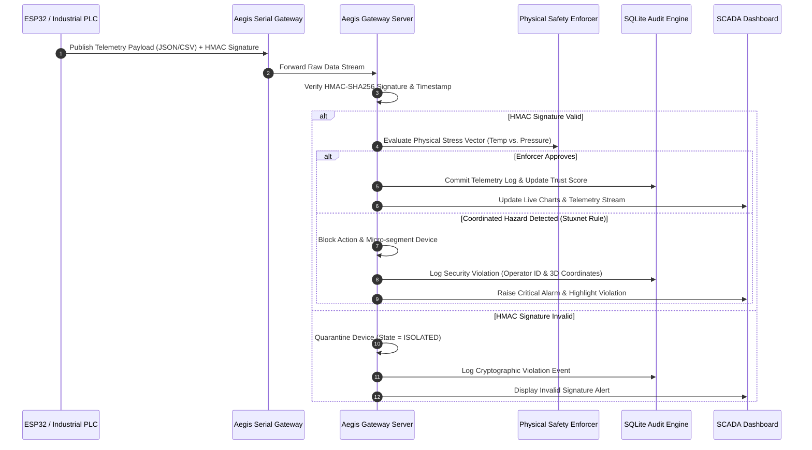

# Aegis ICS - Industrial Zero-Trust Security Gateway & Physical Enforcer

[](https://github.com/anshulec23-cloud/aegis-ics/releases/tag/v2.3.0)
[](#software-application-overview)
[](#quality-assurance--testing)
[](https://www.python.org/)
[](LICENSE)

> **Official Software Application Release (v2.3.0)**: Aegis ICS is a fully functioning, production-ready zero-trust security gateway, physical safety enforcer, and real-time SCADA monitoring application built for Industrial Control Systems (ICS) and Operational Technology (OT) environments.

---

## 📋 Table of Contents
- [Executive Summary & Software Application Overview](#software-application-overview)
- [The Problem Aegis ICS Solves](#the-problem-aegis-ics-solves)
- [Key Features & Capabilities](#key-features--capabilities)
- [System Architecture & Workflow](#system-architecture--workflow)
- [Installation & Quickstart Guide](#installation--quickstart-guide)
- [Hardware & Serial Integration](#hardware--serial-integration)
- [Quality Assurance & Testing](#quality-assurance--testing)
- [REST API Reference](#rest-api-reference)
- [Repository Structure](#repository-structure)
- [Release Notes & Version 2.3.0 Updates](#release-notes--version-230-updates)
- [Authors & Contact](#authors--contact)

---

## 🚀 Software Application Overview

**Aegis ICS** is a complete industrial cybersecurity solution engineered to bridge physical edge devices (such as ESP32 microcontrollers, PLCs, and field sensors) with zero-trust security policies and physical safety enforcement rules. 

Unlike traditional Intrusion Detection Systems (IDS) that passively observe cyberattacks after malicious commands reach physical machinery, **Aegis ICS functions as an active enforcer gateway**. It intercepts telemetry and control commands in real-time, verifying payload HMAC signatures, enforcing cross-parameter physical stress boundaries (preventing Stuxnet-style physical destruction), auditing operator actions with 3D spatial coordinates (`X, Y, Z`), and micro-segmenting compromised devices automatically.

Aegis ICS is distributed as both a standalone desktop application (`AegisICS.exe`) powered by PyWebView and an enterprise Flask web gateway with real-time SCADA interactive dashboards.

---

## 🛡️ The Problem Aegis ICS Solves

1. **Stuxnet-Style Coordinated Physical Stress Attacks**: Cyber-adversaries often send individual commands (e.g., raising temperature or pressure) that appear benign when viewed in isolation, but result in physical destruction when executed concurrently under specific operating states. Aegis ICS evaluates **multi-variable stress vectors** to block dangerous combinations before execution.
2. **Field Device Compromise**: If an edge device or broker credential is hijacked, plain network traffic allows unauthorized command injection. Aegis ICS enforces **HMAC-SHA256 payload signing** on every telemetry packet and command response.
3. **Lack of Spatial & Insider Auditability**: Industrial sabotage often originates from rogue internal operators or compromised credentials. Aegis ICS cryptographically logs operator logins, setpoint changes, and safety violations tagged with the physical 3D location coordinates (`X, Y, Z`) of the control terminal.
4. **Uncontained Blast Radius**: Aegis ICS continuously scores device trust metrics. When anomaly thresholds or HMAC violations occur, the system triggers **automated micro-segmentation**, isolating the rogue device from the control network while maintaining local fail-safe operation.

---

## ✨ Key Features & Capabilities

- 🔒 **Zero-Trust Telemetry Ingestion**: Every sensor transmission is validated for schema structure, timestamp freshness, and HMAC-SHA256 cryptographic signature integrity.
- ⚡ **Stuxnet-Proof Physical Safety Enforcer**: Evaluates mathematical physical limits across temperature, pressure, vibration, current, and RPM variables to reject hazardous operator setpoints.
- 🔌 **Hardware Serial & COM Gateway**: Built-in PySerial communication layer supporting direct USB/Serial connection to ESP32 microcontrollers and industrial PLCs with custom RTS/DTR reset loop prevention.
- 📊 **Real-Time Interactive SCADA Dashboard**: Built with dynamic Chart.js graphing, live telemetry streaming, device quarantine toggles, and safety rule configuration controls.
- 💰 **Financial Risk & Threat Index Engine**: Quantifies potential financial loss, prevented asset damage, telemetry noise index, and sensor drift risk in real time.
- 📄 **Automated PDF & CSV Security Reporting**: Uses ReportLab to dynamically build comprehensive security incident reports complete with operator location metadata and violation logs.
- 🖥️ **Standalone Executable Deployment**: Bundled via PyInstaller into a standalone executable (`AegisICS.exe`) requiring zero pre-installed Python dependencies for deployment.

---

## 📐 System Architecture & Workflow

### Zero-Trust Telemetry & Enforcer Sequence


```mermaid
sequenceDiagram
    autonumber
    participant Field as ESP32 / Industrial PLC
    participant Serial as Aegis Serial Gateway
    participant Server as Aegis Gateway Server
    participant Enforcer as Physical Safety Enforcer
    participant Audit as SQLite Audit Engine
    participant GUI as SCADA Dashboard

    Field->>Serial: Publish Telemetry Payload (JSON/CSV) + HMAC Signature
    Serial->>Server: Forward Raw Data Stream
    Server->>Server: Verify HMAC-SHA256 Signature & Timestamp
    alt HMAC Signature Valid
        Server->>Enforcer: Evaluate Physical Stress Vector (Temp vs. Pressure)
        alt Enforcer Approves
            Server->>Audit: Commit Telemetry Log & Update Trust Score
            Server->>GUI: Update Live Charts & Telemetry Stream
        else Coordinated Hazard Detected (Stuxnet Rule)
            Server->>Server: Block Action & Micro-segment Device
            Server->>Audit: Log Security Violation (Operator ID & 3D Coordinates)
            Server->>GUI: Raise Critical Alarm & Highlight Violation
        end
    else HMAC Signature Invalid
        Server->>Server: Quarantine Device (State = ISOLATED)
        Server->>Audit: Log Cryptographic Violation Event
        Server->>GUI: Display Invalid Signature Alert
    end
```

---

## 📥 Installation & Quickstart Guide

### Option A: Running Standalone Executable (Windows)

1. Download the latest `AegisICS.exe` executable from the [Releases](https://github.com/anshulec23-cloud/aegis-ics/releases) page.
2. Double-click `AegisICS.exe` to start the standalone desktop application.
3. The desktop application window will open automatically with the embedded SCADA dashboard interface.

### Option B: Running from Source Code (Developer Mode)

#### Prerequisites
- **Python 3.12+**
- Git

#### Installation Steps

```powershell
# 1. Clone the repository
git clone https://github.com/anshulec23-cloud/aegis-ics.git
cd aegis-ics

# 2. Set up virtual environment
python -m venv .venv
.\.venv\Scripts\Activate.ps1

# 3. Install required dependencies
pip install -r requirements.txt

# 4. Initialize SQLite Database & Launch Server
python src/app.py
```

After starting `app.py`, navigate to `http://127.0.0.1:5000` in your web browser.

---

## 🔌 Hardware & Serial Integration

Aegis ICS supports direct physical connection with hardware devices (e.g. ESP32, Arduino, industrial sensors):

1. Connect your ESP32 device via USB/Serial to your system.
2. In the Aegis SCADA Dashboard, navigate to the **Hardware Connection** tab.
3. Click **Scan Ports** to detect available COM ports (e.g., `COM3`, `COM4`).
4. Select your baud rate (default: `115200`) and click **Connect**.
5. The gateway will establish a non-resetting serial stream (disabling DTR/RTS) and ingest signed sensor telemetry live.

---

## 🧪 Quality Assurance & Testing

Aegis ICS includes a comprehensive automated test suite covering unit logic, HMAC cryptography, physical safety rules, stress concurrency, fuzzing, and PDF generation.

To run the complete test suite:

```powershell
.venv\Scripts\python.exe -m pytest tests/
```

### Test Coverage Highlights
- ✅ **Database & User Authentication**: User creation, hashed credentials, and spatial audit log verification.
- ✅ **Cryptographic HMAC Security**: Key derivation, canonical payload serialization, and signature matching.
- ✅ **Stuxnet Safety Rules**: Single-parameter boundary enforcement and multi-variable coordinated hazard prevention.
- ✅ **Financial & Threat Index**: Asset loss calculation, noise ratio, and sensor drift risk metrics.
- ✅ **Incident Report Generation**: PDF creation and structural validation via ReportLab.
- ✅ **Serial Parser**: Multi-format parsing (JSON, CSV, Key-Value) with error tolerance.
- ✅ **Stress & Concurrency**: Multi-threaded client API requests under heavy load.
- ✅ **Payload Fuzzing**: Malformed inputs, SQL injection attempts, XSS payloads, and boundary conditions.

---

## 🌐 REST API Reference

| Endpoint | Method | Description |
| :--- | :--- | :--- |
| `/api/data` | `GET` | Fetches live telemetry, financial risk analytics, and recent spatial audit logs. |
| `/api/telemetry` | `POST` | Ingests sensor payload with HMAC-SHA256 signature verification. |
| `/api/setpoint` | `POST` | Issues a SCADA setpoint command subject to Physical Safety Enforcer validation. |
| `/api/rules/update` | `POST` | Configures safety threshold boundaries (max/min temperature and pressure). |
| `/api/simulate-attack` | `POST` | Triggers simulated attacks (`stuxnet`, `injection`, `privilege`) for security testing. |
| `/api/device/isolate` | `POST` | Manually puts the active field device into isolated quarantine. |
| `/api/device/rejoin` | `POST` | Clears device quarantine and restores network connectivity. |
| `/api/report/download` | `GET` | Generates and downloads the official incident audit PDF report. |
| `/api/serial/ports` | `GET` | Lists available COM serial ports on the host system. |
| `/api/serial/connect` | `POST` | Initiates serial gateway data ingestion from a specified COM port. |

---

## 📁 Repository Structure

```text
aegis-ics/
├── build/                 # PyInstaller build artifacts
├── dist/                  # Compiled standalone AegisICS.exe executable
├── docs/                  # Architectural specs and trust scoring documentation
├── src/                   # Core application source code
│   ├── analytics.py       # Financial exposure & threat index engine
│   ├── app.py             # Flask web application & REST API gateway
│   ├── database.py        # SQLAlchemy models & SQLite spatial audit engine
│   ├── launcher.py        # Desktop wrapper entrypoint
│   ├── reporting.py       # ReportLab PDF report generation engine
│   ├── safety_enforcer.py # Stuxnet-proof physical safety rule validator
│   ├── security.py        # HMAC-SHA256 signature & key management
│   ├── serial_gateway.py  # PySerial hardware connection manager
│   ├── simulator.py       # Hardware device telemetry simulator
│   └── templates/         # SCADA dashboard frontend HTML/JS/CSS
├── tests/                 # Comprehensive pytest test suite
├── .env.example           # Environment template configuration
├── pyproject.toml         # Python project configuration
├── README.md              # Project documentation & release overview
└── release_notes.txt      # Release changelog details
```

---

## 🔄 Release Notes & Version 2.3.0 Updates

**Version 2.3.0 Release Summary**:
- **Hardware Connection Stability**: Implemented PySerial DTR/RTS signal suppression to prevent continuous ESP32 reset loops upon connecting.
- **Manual Hardware Connection Panel**: Interactive dashboard controls to select, connect, and disconnect serial COM devices dynamically without restarting services.
- **Enhanced Safety Enforcer**: Multi-variable physical hazard validation for Stuxnet-style coordinated attacks.
- **Updated PDF Reporting**: Full spatial coordinate tracking included in downloadable security audit reports.
- **Zero-Deprecation Compliance**: Updated SQLAlchemy timestamp methods for Python 3.12+ and Python 3.14 runtime environments.

For a full list of historical release changes, see [release_notes.txt](release_notes.txt).

---

## 👤 Authors & Contact

- **Anshul R** (Lead Developer & Security Researcher)
  - **LinkedIn**: [Anshul R](https://www.linkedin.com/in/anshul-r-68b50229a/)
  - **Email**: [anshul.ec23@sahyadri.edu.in](mailto:anshul.ec23@sahyadri.edu.in)
  - **GitHub**: [@anshulec23-cloud](https://github.com/anshulec23-cloud)

---
*Aegis ICS - Safeguard Industrial Operations through Zero-Trust Engineering.*
