# Aegis ICS Live Trust Scoring & Isolation Engine

The trust scoring engine evaluates incoming telemetry packets in real-time to determine if a device has been compromised, spoofed, or is undergoing physical stress. If the computed trust score falls below a set threshold, the gateway executes network-level microsegmentation to isolate the device.

---

## 🧠 ML Trust Engine Model Architecture

Aegis does not rely solely on simple heuristics. Instead, the trust engine uses a **hybrid statistical and rule-based decision model**:

1. **Statistical Model (Random Forest)**: 
   - A supervised **Random Forest Classifier** model (`rf_model.pkl`) predicts the anomaly probability ($P(\text{anomaly})$) based on live feature values (e.g., Temperature, Pressure).
   - The model output is accompanied by a **confidence rating** ($C_{\text{model}} \in [0, 1]$).
2. **Deterministic Fallback**: 
   - If the ML model is unavailable or outputs a low confidence ($C_{\text{model}} < 0.50$), Aegis automatically blends the statistical score with a hardcoded rule-based boundary fallback score ($S_{\text{fallback}}$). This ensures that the system fails safely and cannot be bypassed due to classifier uncertainty.

---

## 📐 Mathematical Scoring Formalism

The final trust score ($T_{\text{final}}$) is computed dynamically. Under normal high-confidence classifier operations ($C_{\text{model}} \ge 0.50$), the score is a weighted linear combination of four security metrics:

\[T_{\text{score}} = 0.35 \cdot (1.0 - S_{\text{anomaly}}) + 0.30 \cdot S_{\text{signature}} + 0.20 \cdot S_{\text{history}} + 0.15 \cdot S_{\text{stability}}\]

### 1. Anomaly Frequency ($S_{\text{anomaly}}$)
Derived directly from the Random Forest probability output:
\[S_{\text{anomaly}} = \text{clamp}(P(\text{anomaly}), 0.0, 1.0)\]

### 2. Cryptographic Signature Validity ($S_{\text{signature}}$)
Ensures message authenticity using HMAC-SHA256 signature verification matching float canonicalized representations:
\[S_{\text{signature}} = \begin{cases} 1.0 & \text{if } \text{HMAC}_{\text{expected}} = \text{HMAC}_{\text{received}} \\ 0.0 & \text{otherwise} \end{cases}\]

### 3. Historical Deviation ($S_{\text{history}}$)
Measures the distance of the current temperature ($T_0$) and pressure ($P_0$) from the rolling means ($\mu_T, \mu_P$) of the last $10$ telemetry points:
\[\delta_T = |T_0 - \mu_T|\]
\[\delta_P = |P_0 - \mu_P|\]
\[\text{Combined Deviation} = \frac{\delta_T}{25.0} + \frac{\delta_P}{5.0}\]
\[S_{\text{history}} = 1.0 - \text{min}\left(1.0, \frac{\text{Combined Deviation}}{2.0}\right)\]

### 4. Sensor Signal Stability ($S_{\text{stability}}$)
Evaluates signal jitter using the population variance ($\sigma^2_T, \sigma^2_P$) of the last $10$ telemetry values to identify sensor tampering or hardware decay:
\[\sigma^2_T = \text{Var}_{\text{pop}}(\{T_i\}_{i=1}^N)\]
\[\sigma^2_P = \text{Var}_{\text{pop}}(\{P_i\}_{i=1}^N)\]
\[\text{Combined Variance} = \frac{\sigma^2_T}{100.0} + \frac{\sigma^2_P}{10.0}\]
\[S_{\text{stability}} = 1.0 - \text{min}(1.0, \text{Combined Variance})\]

---

## 🔀 Low-Confidence Fallback Logic

If the ML classifier outputs low confidence ($C_{\text{model}} < 0.50$), a hybrid score is calculated:

\[T_{\text{final}} = \frac{T_{\text{score}} + S_{\text{fallback}}}{2.0}\]

Where $S_{\text{fallback}}$ starts at $1.0$ and subtracts deterministic safety penalties:
*   **Out-of-bound Temperature** ($T < 0.0^\circ\text{C}$ or $T > 50.0^\circ\text{C}$): $-0.35$ penalty
*   **Out-of-bound Pressure** ($P < 0.0\text{ bar}$ or $P > 8.0\text{ bar}$): $-0.25$ penalty
*   **Invalid HMAC Signature** ($S_{\text{signature}} < 1.0$): $-0.40$ penalty

\[S_{\text{fallback}} = \text{clamp}(1.0 - \text{Penalties}, 0.0, 1.0)\]

---

## 📊 Visual System Architecture & Control Loop

Below is the sequence diagram illustrating the lifecycle of telemetry ingestion, threat scoring, and automated microsegmentation isolation:

```mermaid
sequenceDiagram
    autonumber
    participant Device as ESP32 Device
    participant Broker as MQTT Broker
    participant Server as SCADA Server (Aegis API)
    participant Engine as Trust Engine (RF Classifier)
    participant DB as State Store (Database)

    Device->>Broker: Publish Telemetry (with HMAC-SHA256 signature)
    Broker->>Server: Forward Telemetry Ingest Request
    Server->>Engine: Run Trust Assessment (score())
    
    rect rgb(20, 20, 20)
        Note over Engine: 1. Verify HMAC Signature validity<br/>2. Predict anomaly probability P(anomaly)<br/>3. Compute rolling mean/variance from logs
    end
    
    Engine-->>Server: Return Trust Decision (trust_score, action)
    
    alt If trust_score < 0.40
        Server->>DB: Persist DeviceState (is_isolated=True)
        Server->>Broker: Send Isolation Command (ACL microsegmentation)
        Note over Broker: Broker blocks subsequent traffic from isolated Client ID
        Server-->>Device: [MQTT Control] Command Rejected (Device Isolated)
    else If trust_score >= 0.40
        Server->>DB: Log normal Telemetry & Audit activity
    end
```

